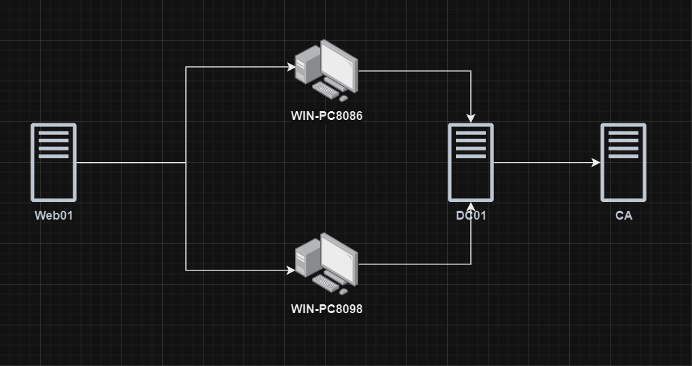

# 《内网渗透体系建设》简易教学练习环境导入说明

## 网络拓扑

|    节点    |                     IP                      |      服务      | 是否双网卡 | 是否域内        |
| :--------: | :-----------------------------------------: | :------------: | :--------: | --------------- |
|   Web01    | 网卡1：NAT 自动获取  网卡2：172.22.10.22 | IIS/SQL Server |   **是**   | 否              |
| WIN-PC8086 |                172.22.10.36                 |       无       |     否     | aerospace.local |
| WIN-PC8098 |                172.22.10.40                 |    PHPStudy    |     否     | aerospace.local |
|    DC01    |                172.22.10.11                 |     AD DS      |     否     | aerospace.local |
|     CA     |                172.22.10.13                 |     AD CS      |     否     | aerospace.local |

## 部署

请通过 VMware Workstation 的 “虚拟网络编辑器” 创建一个新的网卡 “VMnet13”，选择 “仅主机” 模式。并将子网设置成 172.22.10.0/24，如下图所示。

**创建完毕后，分别导入五台虚拟机节点即可。注意这个先后顺序。**

**虚拟机状态为挂起状态，直接点击继续运行即可，请勿做任何改动！！！！！！**

## Flag

| Flag                                       | 节点       | 路径                              |
| ------------------------------------------ | ---------- | --------------------------------- |
| flag{95db2e27-6fac-4712-bf0f-054d4157b8e0} | Web01      | C:\Users\Administrator\flag01.txt |
| flag{16ce20eb-9240-4e00-9f7a-3694c8de6eeb} | WIN-PC8086 | C:\Users\John\flag02.txt          |
| flag{48a92563-36f6-4657-860c-cd8067ac76ba} | WIN-PC8098 | C:\Users\Alice\flag03.txt         |
| flag{341ca80d-0218-4345-bdfc-7faed8a368df} | DC01       | C:\Users\Administrator\flag04.txt |
| flag{70bd246f-b5c4-4b41-926c-ef1015d45619} | CA         | C:\Users\Administrator\flag05.txt |
