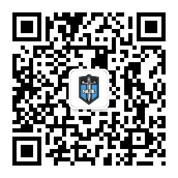

## 关于本平台

本平台为`《从0到1：CTFer成长之路》`书籍配套平台，书中的部分例题程序都会在本平台上进行注明。

同时我们根据所编写的内容，为本书的读者设计了相应的题目，读者可以通过docker或者附件下载的方式进行练习，以便更好地理解、学习本书的内容。

题目的Writeup都更新在Nu1L Team官方公众号中，扫码关注或者微信搜索`Nu1L-Team`即可，根据题目相关页面在微信公众号输入关键词即可获取相应WP。

**如果对此平台亦或者书籍有任何建议，可以发送邮件至book@nu1l.com，我们会及时跟进处理。**

## 关于Nu1L

Nu1L战队成立于2015年10月，源于英文单词"NULL"，国内顶尖CTF联合战队，目前成员有60余人，官网为：[点击这里](https://nu1l.com)。

Nu1L自成立以来，征战于国内外各项CTF赛事，并获得优异成绩，如：

- DEFCONCHINA BCTF2018冠军
- TCTF2018全球总决赛获得全球第四名，国内第一名
- LCTF、SCTF连续三年冠军
- 2018年网鼎杯总决赛全国第二名
- HITCON2018 全球第十名
- 2019年护网杯线上线下双冠王
- 2019年XCTF总决赛冠军
- DEFCON CTF2020线上赛全球第20名
- 2020多场XCTF赛事第一名

`N1CTF`赛事组织者-[点击这里](https://ctftime.org/event/768)

2019年11月与春秋GAME共同负责运维`巅峰极客`线下城市靶场赛。

2019年11月创建`空指针`高质量挑战赛，地址为：[点击这里](https://www.npointer.cn)。

战队部分成员为Blackhat、HITCON、KCON、天府杯等国内外安全会议演讲者，参与过天府杯、PWN2OWN、GEEKPWN等国际性漏洞破解赛事。部分核心队员效力于Tea Deliverers及eee战队

## 本书编写人员（排名不分先后）

付浩、姚诚、李明建、管云超、孙心乾、李建旺、于晨升、吴宇航、陈耀光、林镇鹏、刘子轶、母浩文、鲜槟丞、李柯、秦琦、钱钇冰、郑吉宏、黄伟杰、李依林、赵畅、饶诗豪、周梦禹、李扬、何瑶杰、段景添、林泊儒、周捷、秦石、阳宇鹏

## 致谢人员

感谢**邬江兴院士**、**清华大学段海新教授**为本书作序

感谢**上海交通大学姜开达老师**、**长亭科技杨坤**、**奇安信叶猛**、**永信至诚幻泉**、**四叶草安全马坤**为本书撰写重点推荐语

感谢**春秋GAME 傲客**、**公安部第一研究所网络攻防实验室主任 管磊**、**复旦大学 韩伟力教授**、**北京邮电大学 杨义先教授**、**电子科技大学 张小松教授**、**电子科技大学 周世杰教授**、**南开大学 贾春福教授**、**中国刑警学院 秦玉海教授**、**中国网络空间安全人才教育论坛秘书长 鲁辉**、**知道创宇404实验室 周景平**、**腾讯玄武实验室创始人 于旸**、**腾讯科恩实验室负责人 吴石**、**Riatre**、**国网山东省电力公司网络安全负责人 ForzaInter**、**CongRong**、**山东警察学院 张璇老师**、**山东大学 郭山清教授**、**MaskRay**、**Valo**、**安全小飞侠 avfisher**、**微博@传说中的女网警 高媛**、**奇安信 walk**、**红亚科技 郑洪滨**、**恒安嘉新 刘新鹏**、**边界无限 tomato**、**ChaMd5创始人 M**、**安恒信息 王欣**、**安全播报平台创始人 黄源**、**WCTF世界黑客大师赛运营负责人 王瑶**、**无糖信息CEO 张瑞冬**、**firesun**为本书撰写简短推荐语

感谢<a href="www.baidu.com">aaa</a>[成都无糖信息技术有限公司](https://www.nosugartech.com/admin.html)为本平台提供服务器、存储等相关支撑

## 特别鸣谢

感谢**电子工业出版社章海涛老师及其团队**，是他们专业的指导以及辛苦的校验，才使本书最终与广大读者见面。
